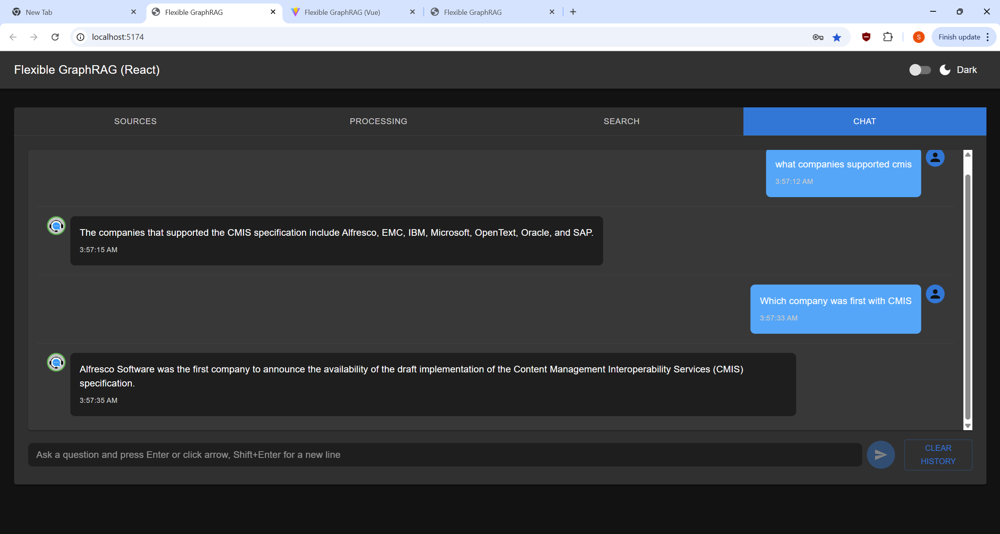
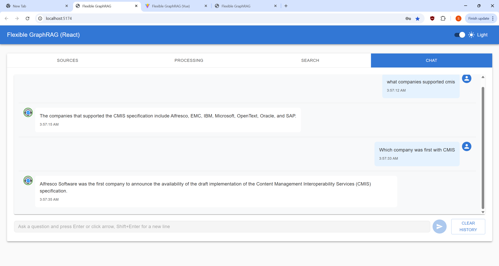

**New!** - [KG Spaces Integration of Flexible GraphRAG in Alfresco ACA Client](https://github.com/stevereiner/kg-spaces-aca)

# Flexible GraphRAG

**Flexible GraphRAG** is an open source platform supporting document processing (Docling or LlamaParse), knowledge graph auto-building, schemas, LlamaIndex LLMs, RAG and GraphRAG setup, hybrid search (fulltext, vector, graph), AI query, and AI chat capabilities. The backend uses Python, LlamaIndex, and FastAPI. Has Angular, React, and Vue TypeScript frontends. A MCP Server is also available. Currently supports 13 data sources, 10 vector databases, OpenSearch / Elasticsearch search, 8 graph databases, and Alfresco.  These servers and their dashboards can be configured in a provided docker compose.

<p align="center">
  <a href="./screen-shots/react/chat-webpage.png">
    
  </a>
</p>

<p align="center"><em>Flexible GraphRAG AI chat tab with a web pages data source generated graph displayed in Neo4j</em></p>


## Features

- **Hybrid Search**: A configurable hybrid search system that combines vector search, full-text search, and graph GraphRAG
- **Knowledge Graph GraphRAG**: Extracts entities and relationships from documents to auto create graphs in graph databases for GraphRAG. Configuration for schemas to use or use
as a starting point for LLM to expand on is supported.
- **Configurable Architecture**: LlamaIndex provides abstractions for allowing multiple vector databases, graph databases, search engines, and LLM providers to be supported
- **Multi-Source Ingestion**: Processes documents from 13 data sources (file upload, cloud storage, enterprise repositories, web sources) with Docling (default) or LlamaParse (cloud API) document parsing.
- **Observability**: Built-in OpenTelemetry instrumentation with automatic LlamaIndex tracing, Prometheus metrics, Jaeger traces, and Grafana dashboards for production monitoring
- **FastAPI Server with REST API**: Python based FastAPI server with REST APIs for document ingesting, hybrid search, AI query, and AI chat.
- **MCP Server**: MCP server providing Claude Desktop and other MCP clients with tools for document/text ingesting (all 13 data sources), hybrid search, and AI query. Uses FastAPI backend REST APIs. 
- **UI Clients**: Angular, React, and Vue UI clients support choosing the data source (filesystem, Alfresco, CMIS, etc.), ingesting documents, performing hybrid searches, AI queries, and AI chat. The UI clients use the REST APIs of the FastAPI backend.
- **Docker Deployment Flexibility**: Supports both standalone and Docker deployment modes. Docker infrastructure provides modular database selection via docker-compose includes - vector, graph, search engines, and Alfresco can be included or excluded with a single comment. Choose between hybrid deployment (databases in Docker, backend and UIs standalone) or full containerization.

## Frontend Screenshots

### Angular Frontend - Tabbed Interface

<details>
<summary>Click to view Angular UI screenshots (Light Theme)</summary>

| Sources Tab | Processing Tab | Search Tab | Chat Tab |
|-------------|----------------|------------|----------|
| [](./screen-shots/angular/angular-sources.png) | [](./screen-shots/angular/angular-processing.png) | [](./screen-shots/angular/angular-search.png) | [](./screen-shots/angular/angular-chat.png) |

</details>

### React Frontend - Tabbed Interface

<details open>
<summary>Click to view React UI screenshots (Dark Theme)</summary>

| Sources Tab | Processing Tab | Search Tab | Chat Tab |
|-------------|----------------|------------|----------|
| [](./screen-shots/react/react-sources.png) | [](./screen-shots/react/react-processing.png) | [](./screen-shots/react/react-search-hybrid-search.png) | [](./screen-shots/react/react-chat-using.png) |

</details>

<details>
<summary>Click to view React UI screenshots (Light Theme)</summary>

| Sources Tab | Processing Tab | Search Tab | Chat Tab |
|-------------|----------------|------------|----------|
| [](./screen-shots/react/react-sources-light.png) | [](./screen-shots/react/react-processing-light.png) | [](./screen-shots/react/react-search-hybrid-search-light.png) | [](./screen-shots/react/react-chat-using-light.png) |

</details>

### Vue Frontend - Tabbed Interface

<details>
<summary>Click to view Vue UI screenshots (Light Theme)</summary>

| Sources Tab | Processing Tab | Search Tab | Chat Tab |
|-------------|----------------|------------|----------|
| [](./screen-shots/vue/vue-sources.png) | [](./screen-shots/vue/vue-processing.png) | [](./screen-shots/vue/vue-search.png) | [](./screen-shots/vue/vue-chat.png) |

</details>

## System Components

### FastAPI Backend (`/flexible-graphrag`)
- **REST API Server**: Provides endpoints for document ingestion, search, and AI query/chat
- **Hybrid Search Engine**: Combines vector similarity (RAG), fulltext (BM25), and graph traversal (GraphRAG)
- **Document Processing**: Advanced document conversion with Docling and LlamaParse integration
- **Configurable Architecture**: Environment-based configuration for all components
- **Async Processing**: Background task processing with real-time progress updates

### MCP Server (`/flexible-graphrag-mcp`)  
- **MCP Client support**: Model Context Protocol server for Claude Desktop and other MCP clients
- **Full API Parity**: Tools like `ingest_documents()` support all 13 data sources with source-specific configs: filesystem, repositories (Alfresco, SharePoint, Box, CMIS), cloud storage, web; `skip_graph` flag for all data sources; `paths` parameter for filesystem/Alfresco/CMIS; Alfresco also supports `nodeDetails` list (multi-select for KG Spaces)
- **Additional Tools**: `search_documents()`, `query_documents()`, `ingest_text()`, system diagnostics, and health checks
- **Dual Transport**: HTTP mode for debugging, stdio mode for production
- **Tool Suite**: 9 specialized tools for document processing, search, and system management
- **Multiple Installation**: pipx system installation or uvx no-install execution

### UI Clients (`/flexible-graphrag-ui`)
- **Angular Frontend**: Material Design with TypeScript
- **React Frontend**: Modern React with Vite and TypeScript  
- **Vue Frontend**: Vue 3 Composition API with Vuetify and TypeScript
- **Unified Features**: All clients support the 4 tab views, async processing, progress tracking, and cancellation

### Docker Infrastructure (`/docker`)
- **Modular Database Selection**: Include/exclude vector, graph, and search engines, and Alfresco with single-line comments
- **Flexible Deployment**: Hybrid mode (databases in Docker, apps standalone) or full containerization
- **NGINX Reverse Proxy**: Unified access to all services with proper routing
- **Built-in Database Dashboards**: Most server dockers also provide built-in web interface dashboards (Neo4j browser, ArcadeDB, FalkorDB, OpenSearch, etc.)
- **Separate Dashboards**: Additional dashboard dockers are provided: including Kibana for Elasticsearch and Kuzu Explorer.

## Data Sources

Flexible GraphRAG supports **13 different data sources** for ingesting documents into your knowledge base:

<p align="center">
  <a href="./screen-shots/react/data-sources-1.jpeg">
    
  </a>
</p>

### File & Upload Sources
1. **File Upload** - Direct file upload through web interface with drag & drop support


### Cloud Storage Sources
2. **Amazon S3** - AWS S3 bucket integration
3. **Google Cloud Storage (GCS)** - Google Cloud storage buckets
4. **Azure Blob Storage** - Microsoft Azure blob containers
5. **OneDrive** - Microsoft OneDrive personal/business storage
6. **Google Drive** - Google Drive file storage

### Enterprise Repository Sources
7. **Alfresco** - Alfresco ECM/content repository with two integration options:
   - **[KG Spaces ACA Extension](https://github.com/stevereiner/kg-spaces-aca)** - Integrates the Flexible GraphRAG Angular UI as an extension plugin within the Alfresco Content Application (ACA), enabling multi-select document/folder ingestion with nodeIds directly from the Alfresco interface
   - **Flexible GraphRAG Alfresco Data Source** - Direct integration using Alfresco paths (e.g., /Shared/GraphRAG, /Company Home/Shared/GraphRAG, or /Shared/GraphRAG/cmispress.txt)
8. **SharePoint** - Microsoft SharePoint document libraries
9. **Box** - Box.com cloud storage
10. **CMIS (Content Management Interoperability Services)** - Industry-standard content repository interface

### Web Sources
11. **Web Pages** - Extract content from web URLs
12. **Wikipedia** - Ingest Wikipedia articles by title or URL
13. **YouTube** - Process YouTube video transcripts

Each data source includes:
- **Configuration Forms**: Easy-to-use interfaces for credentials and settings
- **Progress Tracking**: Real-time per-file progress indicators
- **Flexible Authentication**: Support for various auth methods (API keys, OAuth, service accounts)

### Document Processing Options

All data sources support two document parser options:

**Docling (Default)**:
- Open-source, local processing
- Free with no API costs
- **GPU acceleration** supported (CUDA/Apple Silicon) for 5-10x faster processing
- Built-in OCR for images and scanned documents
- Multi-language support (English, German, French, Spanish, Czech, Russian, Chinese, Japanese, etc.)
- Configured via: `DOCUMENT_PARSER=docling`
- **New**: `DOCLING_DEVICE=auto|cpu|cuda|mps` - Control GPU vs CPU processing
- **New**: `SAVE_PARSING_OUTPUT=true` - Save intermediate parsing results for inspection (works for both parsers)
- **New**: `PARSER_FORMAT_FOR_EXTRACTION=auto|markdown|plaintext` - Control format used for knowledge graph extraction
- See [Docling GPU Configuration Guide](docs/DOCLING-GPU-CONFIGURATION.md) for setup details | [Quick Reference](DOCLING-QUICK-REFERENCE.md)

**LlamaParse**:
- Cloud-based API service with advanced AI
- Multimodal parsing with Claude Sonnet 3.5
- Three modes available:
  - `parse_page_without_llm` - 1 credit/page
  - `parse_page_with_llm` - 3 credits/page (default)
  - `parse_page_with_agent` - 10-90 credits/page
- Configured via: `DOCUMENT_PARSER=llamaparse` + `LLAMAPARSE_API_KEY`
- Get your API key from [LlamaCloud](https://cloud.llamaindex.ai/)
- **New**: `SAVE_PARSING_OUTPUT=true` - Save parsed output and metadata for inspection
- **New**: `PARSER_FORMAT_FOR_EXTRACTION=auto|markdown|plaintext` - Control format used for knowledge graph extraction

## Supported File Formats

### Document Formats
- **PDF**: `.pdf`
  - **Docling**: Advanced layout analysis, table extraction, formula recognition, configurable OCR (EasyOCR, Tesseract, RapidOCR)
  - **LlamaParse**: Automatic OCR within parsing pipeline, multimodal vision processing
- **Microsoft Office**: `.docx`, `.xlsx`, `.pptx` and legacy formats (`.doc`, `.xls`, `.ppt`)
  - **Docling**: DOCX, XLSX, PPTX structure preservation and content extraction
  - **LlamaParse**: Full Office suite support including legacy formats and hundreds of variants
- **Web Formats**: `.html`, `.htm`, `.xhtml`
  - **Docling**: HTML/XHTML markup structure analysis
  - **LlamaParse**: HTML/XHTML content extraction and formatting
- **Data Formats**: `.csv`, `.tsv`, `.json`, `.xml`
  - **Docling**: CSV structured data processing
  - **LlamaParse**: CSV, TSV, JSON, XML with enhanced table understanding
- **Documentation**: `.md`, `.markdown`, `.asciidoc`, `.adoc`, `.rtf`, `.txt`, `.epub`
  - **Docling**: Markdown, AsciiDoc technical documentation with markup preservation
  - **LlamaParse**: Extended format support including RTF, EPUB, and hundreds of text format variants

### Image Formats
- **Standard Images**: `.png`, `.jpg`, `.jpeg`, `.gif`, `.bmp`, `.webp`, `.tiff`, `.tif`
  - **Docling**: OCR text extraction with configurable OCR backends (EasyOCR, Tesseract, RapidOCR)
  - **LlamaParse**: Automatic OCR with multimodal vision processing and context understanding

### Audio Formats
- **Audio Files**: `.wav`, `.mp3`, `.mp4`, `.m4a`
  - **Docling**: Automatic speech recognition (ASR) support
  - **LlamaParse**: Transcription and content extraction for MP3, MP4, MPEG, MPGA, M4A, WAV, WEBM

### Processing Intelligence
- **Parser Selection**: 
  - **Docling** (default, free): Local processing with specialized CV models (DocLayNet layout analysis, TableFormer for tables), configurable OCR backends (EasyOCR/Tesseract/RapidOCR), optional local VLM support (Granite-Docling, SmolDocling, Qwen2.5-VL, Pixtral)
  - **LlamaParse** (cloud API, 3 credits/page): Automatic OCR in parsing pipeline, supports hundreds of file formats, fast mode (OCR-only), default mode (proprietary LlamaCloud model), premium mode (proprietary VLM mixture), multimodal mode (bring your own API keys: OpenAI GPT-4o, Anthropic Claude 3.5/4.5 Sonnet, Google Gemini 1.5/2.0, Azure OpenAI)
- **Output Formats**: 
  - **Flexible GraphRAG** saves both markdown and plaintext, then automatically selects which to use for processing (knowledge graph extraction, vector embeddings, and search indexing) - defaults to markdown for tables, plaintext for text-heavy docs - override with `PARSER_FORMAT_FOR_EXTRACTION`
  - **Docling** supports: Markdown, JSON (lossless with bounding boxes and provenance), HTML, plain text, and DocTags (specialized markup preserving multi-column layouts, mathematical formulas, and code blocks)
  - **LlamaParse** supports: Markdown, plain text, raw JSON, XLSX (extracted tables), PDF, images (extracted separately), and structured output (beta - enforces custom JSON schema for strict data model extraction)
- **Format Detection**: Automatic routing based on file extension and content analysis

## Database Configuration

Flexible GraphRAG uses three types of databases for its hybrid search capabilities. Each can be configured independently via environment variables.

### Search Databases (Full-Text Search)

**Configuration**: Set via `SEARCH_DB` and `SEARCH_DB_CONFIG` environment variables

- **BM25 (Built-in)**: Local file-based BM25 full-text search with TF-IDF ranking
  - Dashboard: None (file-based)
  - Configuration:
    ```bash
    SEARCH_DB=bm25
    SEARCH_DB_CONFIG={"persist_dir": "./bm25_index"}
    ```

- **Elasticsearch**: Enterprise search engine with advanced analyzers, faceted search, and real-time analytics
  - Dashboard: Kibana (http://localhost:5601) for search analytics, index management, and query debugging
  - Configuration:
    ```bash
    SEARCH_DB=elasticsearch
    SEARCH_DB_CONFIG={"hosts": ["http://localhost:9200"], "index_name": "hybrid_search"}
    ```

- **OpenSearch**: AWS-led open-source fork with native hybrid scoring (vector + BM25) and k-NN algorithms
  - Dashboard: OpenSearch Dashboards (http://localhost:5601) for cluster monitoring and search pipeline management
  - Configuration:
    ```bash
    SEARCH_DB=opensearch
    SEARCH_DB_CONFIG={"hosts": ["http://localhost:9201"], "index_name": "hybrid_search"}
    ```

- **None**: Disable full-text search (vector search only)
  - Configuration:
    ```bash
    SEARCH_DB=none
    ```

### Vector Databases (Semantic Search)

**Configuration**: Set via `VECTOR_DB` and `VECTOR_DB_CONFIG` environment variables

#### ⚠️ Vector Dimension Compatibility

**CRITICAL**: When switching between different embedding models (e.g., OpenAI ↔ Ollama), you **MUST delete existing vector indexes** due to dimension incompatibility:

- **OpenAI**: 1536 dimensions (text-embedding-3-small) or 3072 dimensions (text-embedding-3-large)
- **Ollama**: 384 dimensions (all-minilm, default), 768 dimensions (nomic-embed-text), or 1024 dimensions (mxbai-embed-large)
- **Azure OpenAI**: Same as OpenAI (1536 or 3072 dimensions)

**See [VECTOR-DIMENSIONS.md](VECTOR-DIMENSIONS.md) for detailed cleanup instructions for each database.**

#### Supported Vector Databases

- **Neo4j**: Can be used as vector database with separate vector configuration
  - Dashboard: Neo4j Browser (http://localhost:7474) for Cypher queries and graph visualization
  - Configuration:
    ```bash
    VECTOR_DB=neo4j
    VECTOR_DB_CONFIG={"uri": "bolt://localhost:7687", "username": "neo4j", "password": "your_password", "index_name": "hybrid_search_vector"}
    ```

- **Qdrant**: Dedicated vector database with advanced filtering
  - Dashboard: Qdrant Web UI (http://localhost:6333/dashboard) for collection management
  - Configuration:
    ```bash
    VECTOR_DB=qdrant
    VECTOR_DB_CONFIG={"host": "localhost", "port": 6333, "collection_name": "hybrid_search"}
    ```

- **Elasticsearch**: Can be used as vector database with separate vector configuration
  - Dashboard: Kibana (http://localhost:5601) for index management and data visualization
  - Configuration:
    ```bash
    VECTOR_DB=elasticsearch
    VECTOR_DB_CONFIG={"hosts": ["http://localhost:9200"], "index_name": "hybrid_search_vectors"}
    ```

- **OpenSearch**: Can be used as vector database with separate vector configuration
  - Dashboard: OpenSearch Dashboards (http://localhost:5601) for cluster and index management
  - Configuration:
    ```bash
    VECTOR_DB=opensearch
    VECTOR_DB_CONFIG={"hosts": ["http://localhost:9201"], "index_name": "hybrid_search_vectors"}
    ```

- **Chroma**: Open-source vector database with dual deployment modes
  - Dashboard: Swagger UI (http://localhost:8001/docs/) for API testing and management (HTTP mode)
  - Configuration (Local Mode):
    ```bash
    VECTOR_DB=chroma
    VECTOR_DB_CONFIG={"persist_directory": "./chroma_db", "collection_name": "hybrid_search"}
    ```
  - Configuration (HTTP Mode):
    ```bash
    VECTOR_DB=chroma
    VECTOR_DB_CONFIG={"host": "localhost", "port": 8001, "collection_name": "hybrid_search"}
    ```

- **Milvus**: Cloud-native, scalable vector database for similarity search
  - Dashboard: Attu (http://localhost:3003) for cluster and collection management
  - Configuration:
    ```bash
    VECTOR_DB=milvus
    VECTOR_DB_CONFIG={"uri": "http://localhost:19530", "collection_name": "hybrid_search"}
    ```

- **Weaviate**: Vector search engine with semantic capabilities and data enrichment
  - Dashboard: Weaviate Console (http://localhost:8081/console) for schema and data management
  - Configuration:
    ```bash
    VECTOR_DB=weaviate
    VECTOR_DB_CONFIG={"url": "http://localhost:8081", "index_name": "HybridSearch"}
    ```

- **Pinecone**: Managed vector database service optimized for real-time applications
  - Dashboard: Pinecone Console (web-based) for index and namespace management
  - Local Info Dashboard: http://localhost:3004 (when using Docker)
  - Configuration:
    ```bash
    VECTOR_DB=pinecone
    VECTOR_DB_CONFIG={"api_key": "your_api_key", "region": "us-east-1", "cloud": "aws", "index_name": "hybrid-search"}
    ```

- **PostgreSQL**: Traditional database with pgvector extension for vector similarity search
  - Dashboard: pgAdmin (http://localhost:5050) for database management, vector queries, and similarity searches
  - Configuration:
    ```bash
    VECTOR_DB=postgres
    VECTOR_DB_CONFIG={"host": "localhost", "port": 5433, "database": "postgres", "username": "postgres", "password": "your_password"}
    ```

- **LanceDB**: Modern, lightweight vector database designed for high-performance ML applications
  - Dashboard: LanceDB Viewer (http://localhost:3005) for CRUD operations and data management
  - Configuration:
    ```bash
    VECTOR_DB=lancedb
    VECTOR_DB_CONFIG={"uri": "./lancedb", "table_name": "hybrid_search"}
    ```

#### RAG without GraphRAG

For faster document ingest processing (no graph extraction), and hybrid search with only full text + vector, configure:
```bash
VECTOR_DB=qdrant  # Any vector store
SEARCH_DB=elasticsearch  # Any search engine
GRAPH_DB=none
ENABLE_KNOWLEDGE_GRAPH=false
```


### Graph Databases (Knowledge Graph / GraphRAG)

**Configuration**: Set via `GRAPH_DB` and `GRAPH_DB_CONFIG` environment variables

- **Neo4j Property Graph**: Primary knowledge graph storage with Cypher querying
  - Dashboard: Neo4j Browser (http://localhost:7474) for graph exploration and query execution
  - Configuration:
    ```bash
    GRAPH_DB=neo4j
    GRAPH_DB_CONFIG={"uri": "bolt://localhost:7687", "username": "neo4j", "password": "your_password"}
    ```

- **Kuzu**: Embedded graph database built for query speed and scalability, optimized for handling complex analytical workloads on very large graph databases. Supports the property graph data model and the Cypher query language. **(Note: Kuzu proper is no longer being developed. Will support LadybugDB fork when LlamaIndex support is available)**
  - Dashboard: Kuzu Explorer (http://localhost:8002) for graph visualization and Cypher queries
  - Configuration:
    ```bash
    GRAPH_DB=kuzu
    GRAPH_DB_CONFIG={"db_path": "./kuzu_db", "use_structured_schema": true, "use_vector_index": true}
    ```

- **FalkorDB**: "A super fast Graph Database uses GraphBLAS under the hood for its sparse adjacency matrix graph representation. Our goal is to provide the best Knowledge Graph for LLM (GraphRAG)."
  - Dashboard: FalkorDB Browser (http://localhost:3001) (Was moved from 3000 used by the flexible-graphrag Vue frontend)
  - Configuration:
    ```bash
    GRAPH_DB=falkordb
    GRAPH_DB_CONFIG={"url": "falkor://localhost:6379", "database": "falkor"}
    ```

- **ArcadeDB**: Multi-model database supporting graph, document, key-value, and search capabilities with SQL and Cypher query support
  - Dashboard: ArcadeDB Studio (http://localhost:2480) for graph visualization, SQL/Cypher queries, and database management
  - Configuration:
    ```bash
    GRAPH_DB=arcadedb
    GRAPH_DB_CONFIG={"host": "localhost", "port": 2480, "username": "root", "password": "password", "database": "flexible_graphrag", "query_language": "sql"}
    ```

- **MemGraph**: Real-time graph database with native support for streaming data and advanced graph algorithms
  - Dashboard: MemGraph Lab (http://localhost:3002) for graph visualization and Cypher queries
  - Configuration:
    ```bash
    GRAPH_DB=memgraph
    GRAPH_DB_CONFIG={"url": "bolt://localhost:7687", "username": "", "password": ""}
    ```

- **NebulaGraph**: Distributed graph database designed for large-scale data with horizontal scalability
  - Dashboard: NebulaGraph Studio (http://localhost:7001) for graph exploration and nGQL queries
  - Configuration:
    ```bash
    GRAPH_DB=nebula
    GRAPH_DB_CONFIG={"space": "flexible_graphrag", "host": "localhost", "port": 9669, "username": "root", "password": "nebula"}
    ```

- **Amazon Neptune**: Fully managed graph database service supporting both property graph and RDF models
  - Dashboard: Graph-Explorer (http://localhost:3007) for visual graph exploration, or Neptune Workbench (AWS Console) for Jupyter-based queries
  - Configuration:
    ```bash
    GRAPH_DB=neptune
    GRAPH_DB_CONFIG={"host": "your-cluster.region.neptune.amazonaws.com", "port": 8182}
    ```

- **Amazon Neptune Analytics**: Serverless graph analytics engine for large-scale graph analysis with openCypher support
  - Dashboard: Graph-Explorer (http://localhost:3007) or Neptune Workbench (AWS Console)
  - Configuration:
    ```bash
    GRAPH_DB=neptune_analytics
    GRAPH_DB_CONFIG={"graph_identifier": "g-xxxxx", "region": "us-east-1"}
    ```

- **None**: Disable knowledge graph extraction for RAG-only mode
  - Configuration:
    ```bash
    GRAPH_DB=none
    ENABLE_KNOWLEDGE_GRAPH=false
    ```
  - Use when you want vector + full-text search without graph traversal

## LLM Configuration

**Configuration**: Set via `LLM_PROVIDER` and provider-specific environment variables. See [docs/LLM-EMBEDDING-CONFIG.md](docs/LLM-EMBEDDING-CONFIG.md) for detailed examples and all options.

### Supported LLM Providers

1. **OpenAI** - gpt-4o-mini (default), gpt-4o, gpt-4.1-mini, gpt-5-mini, etc.
2. **Ollama** - Local deployment (llama3.2, llama3.1, qwen2.5, gpt-oss, etc.)
3. **Azure OpenAI** - Azure-hosted OpenAI models
4. **Google Gemini** - gemini-2.5-flash, gemini-3-flash-preview, gemini-3-pro-preview, etc.
5. **Anthropic Claude** - claude-sonnet-4-5, claude-haiku-4-5, etc.
6. **Google Vertex AI** - Google Cloud-hosted Vertex AI Platform Gemini models
7. **Amazon Bedrock** - Amazon Nova, Titan, Anthropic Claude, Meta Llama, Mistral AI, etc.
8. **Groq** - Fast low-cost LPU inference, low latency: OpenAI GPT-OSS, Meta Llama (4, 3.3, 3.1), Qwen3, Kimi, etc.
9. **Fireworks AI** - More choices, fine-tuning: Meta, Qwen, Mistral AI, DeepSeek, OpenAI GPT-OSS, Kimi, GLM, MiniMax, etc.

### Quick Start Examples

**OpenAI** (recommended):
```bash
LLM_PROVIDER=openai
OPENAI_API_KEY=your_api_key
OPENAI_MODEL=gpt-4o-mini
```

**Ollama** (local):
```bash
LLM_PROVIDER=ollama
OLLAMA_BASE_URL=http://localhost:11434
OLLAMA_MODEL=llama3.2:latest
```

**Azure OpenAI**:
```bash
LLM_PROVIDER=azure_openai
AZURE_OPENAI_API_KEY=your_key
AZURE_OPENAI_ENDPOINT=https://your-resource.openai.azure.com/
AZURE_OPENAI_ENGINE=gpt-4o-mini
```

### Embedding Configuration

Embeddings can be configured independently of the LLM provider:

**OpenAI**:
```bash
EMBEDDING_KIND=openai
EMBEDDING_MODEL=text-embedding-3-small
EMBEDDING_DIMENSION=1536  # Auto-detected if not specified
```

**Ollama**:
```bash
EMBEDDING_KIND=ollama
EMBEDDING_MODEL=all-minilm
EMBEDDING_DIMENSION=384  # Auto-detected if not specified
```

**Common embedding dimensions:**
- OpenAI: 1536 (text-embedding-3-small), 3072 (text-embedding-3-large)
- Ollama: 384 (all-minilm, default), 768 (nomic-embed-text), 1024 (mxbai-embed-large)
- Google: 768 (text-embedding-004, configurable with output_dimensionality parameter)

**Note**: When switching embedding models, you must delete existing vector indexes due to dimension incompatibility. See [VECTOR-DIMENSIONS.md](VECTOR-DIMENSIONS.md) for cleanup instructions.

### Ollama Configuration

When using Ollama, configure system-wide environment variables before starting the Ollama service:

**Key requirements**:
- Configure environment variables **system-wide** (not in Flexible GraphRAG `.env` file)
- `OLLAMA_NUM_PARALLEL=4` for optimal performance (or 1-2 if resource constrained)
- Always restart Ollama service after changing environment variables

See [docs/OLLAMA-CONFIGURATION.md](docs/OLLAMA-CONFIGURATION.md) for complete setup instructions including platform-specific steps and performance optimization.


## Prerequisites

### Required
- Python 3.12 or 3.13 (as specified in `pyproject.toml` - 3.14 has LlamaIndex ChromaDB compatibility issues)
- UV package manager (for dependency management)
- Node.js 22.x (for UI clients)
- npm (package manager)
- Search database: Elasticsearch or OpenSearch
- Vector database: Qdrant (or other supported vector databases)
- Graph database: Neo4j (or other supported graph databases) - unless using vector-only RAG
- OpenAI with API key (recommended) or Ollama (for LLM processing)

**Note**: The `docker/docker-compose.yaml` file can provide all these databases via Docker containers.

### Optional (depending on data source)
- **Enterprise Repositories**:
  - Alfresco repository - only if using Alfresco data source
  - SharePoint - requires SharePoint access
  - Box - requires Box Business account (3 users minimum), API keys
  - CMIS-compliant repository (e.g., Alfresco) - only if using CMIS data source
- **Cloud Storage** (requires accounts and API keys/credentials):
  - Amazon S3 - requires AWS account and access keys
  - Google Cloud Storage - requires GCP account and service account credentials
  - Google Drive - requires Google Cloud account and OAuth credentials or service account
  - Azure Blob Storage - requires Azure account and connection string or account keys
  - Microsoft OneDrive - requires OneDrive for Business (not personal OneDrive)
  - **Note**: SharePoint and OneDrive for Business are also available with a M365 Developer Program sandbox (with full Visual Studio annual subscription, not monthly).
- **File Upload** (no account required):
  - Web interface with file dialog (drag & drop or click to select)
- **Web Sources** (no account required):
  - Web pages, Wikipedia, YouTube - no accounts needed

## Setup

### 🐳 Docker Deployment

Docker deployment offers multiple scenarios. Before deploying any scenario, set up your environment files:

**Environment File Setup (Required for All Scenarios):**

1. **Backend Configuration** (`.env`):
   ```bash
   # Navigate to backend directory
   cd flexible-graphrag
   
   # Linux/macOS
   cp env-sample.txt .env
   
   # Windows Command Prompt
   copy env-sample.txt .env
   
   # Edit .env with your database credentials, API keys, and settings
   # Then return to project root
   cd ..
   ```

2. **Docker Configuration** (`docker.env`):
   ```bash
   # Navigate to docker directory
   cd docker
   
   # Linux/macOS
   cp docker-env-sample.txt docker.env
   
   # Windows Command Prompt
   copy docker-env-sample.txt docker.env
   
   # Edit docker.env for Docker-specific overrides (network addresses, service names)
   # Stay in docker directory for next steps
   ```

---

#### Scenario A: Databases in Docker, App Standalone (Hybrid)

**Configuration Setup:**
```bash
# If not already in docker directory from previous step:
# cd docker

# Edit docker-compose.yaml to uncomment/comment services as needed
# Scenario A setup in docker-compose.yaml:
# Keep these services uncommented (default setup):
  - includes/neo4j.yaml
  - includes/qdrant.yaml
  - includes/elasticsearch-dev.yaml
  - includes/kibana-simple.yaml

# Keep these services commented out:
# - includes/app-stack.yaml       # Must be commented out for Scenario A
# - includes/proxy.yaml           # Must be commented out for Scenario A
# - All other services remain commented unless you want a different vector database, 
#   graph database, OpenSearch for search, or Alfresco included
```

**Deploy Services:**
```bash
# From the docker directory
docker-compose -f docker-compose.yaml -p flexible-graphrag up -d
```

#### Scenario B: Full Stack in Docker (Complete)

**Configuration Setup:**
```bash
# If not already in docker directory from previous step:
# cd docker

# Edit docker-compose.yaml to uncomment/comment services as needed
# Scenario B setup in docker-compose.yaml:
# Keep these services uncommented:
  - includes/neo4j.yaml
  - includes/qdrant.yaml
  - includes/elasticsearch-dev.yaml
  - includes/kibana-simple.yaml
  - includes/app-stack.yaml       # Backend and UI in Docker
  - includes/proxy.yaml           # NGINX reverse proxy

# Keep other services commented out unless you want a different vector database,
# graph database, OpenSearch for search, or Alfresco included
```

**Deploy Services:**
```bash
# From the docker directory
docker-compose -f docker-compose.yaml -p flexible-graphrag up -d
```

**Scenario B Service URLs:**
- **Angular UI**: http://localhost:8070/ui/angular/
- **React UI**: http://localhost:8070/ui/react/  
- **Vue UI**: http://localhost:8070/ui/vue/
- **Backend API**: http://localhost:8070/api/

#### Other Deployment Scenarios

**Scenario C: Fully Standalone** - Not using docker-compose at all
- Standalone backend, standalone UIs, all databases running separately
- Configure all database connections in `flexible-graphrag/.env`

**Scenario D: Backend/UIs in Docker, Databases External**
- Using docker-compose for backend and UIs (app-stack + proxy)
- Some or all databases running separately (same docker-compose, other local Docker, cloud/remote servers)
- Configure database connections in `docker/docker.env`: Backend in Docker reads this file
  - For databases in same docker-compose: Use service names (e.g., `neo4j:7687`, `qdrant:6333`)
  - For databases in other local Docker containers: Use `host.docker.internal:PORT`
  - For remote/cloud databases: Use actual hostnames/IPs

**Scenario E: Mixed Docker/Standalone**
- Standalone backend and UIs
- Running some databases in Docker (local) and some outside (cloud, external servers)
- Configure all database connections in `flexible-graphrag/.env`: Use `host.docker.internal:PORT` for locally-running Docker databases, use actual hostnames/IPs for remote Docker or non-Docker databases

#### Docker Control and Configuration

**Managing Docker services:**

```bash
# Navigate to docker directory (if not already there)
cd docker

# Create and start services (recreates if configuration changed)
docker-compose -f docker-compose.yaml -p flexible-graphrag up -d

# Stop services (keeps containers)
docker-compose -f docker-compose.yaml -p flexible-graphrag stop

# Start stopped services
docker-compose -f docker-compose.yaml -p flexible-graphrag start

# Stop and remove services
docker-compose -f docker-compose.yaml -p flexible-graphrag down

# View logs
docker-compose -f docker-compose.yaml -p flexible-graphrag logs -f

# Restart after configuration changes
docker-compose -f docker-compose.yaml -p flexible-graphrag down
# Edit docker-compose.yaml, docker.env, or includes/app-stack.yaml as needed
docker-compose -f docker-compose.yaml -p flexible-graphrag up -d
```

**Configuration:**
- **Modular deployment**: Comment/uncomment services in `docker/docker-compose.yaml`
- **Backend configuration** (Scenario B): Backend uses `flexible-graphrag/.env` with `docker/docker.env` for Docker-specific overrides (like using service names instead of localhost). No configuration needed in `app-stack.yaml`

See [docker/README.md](./docker/README.md) for detailed Docker configuration.

### 🔧 Local Development Setup (Scenario A)

**Note**: Skip this entire section if using Scenario B (Full Stack in Docker).

#### Environment Configuration

**Create environment file** (cross-platform):
```bash
# Linux/macOS
cp flexible-graphrag/env-sample.txt flexible-graphrag/.env

# Windows Command Prompt  
copy flexible-graphrag\env-sample.txt flexible-graphrag\.env
```
Edit `.env` with your database credentials and API keys.

### Python Backend Setup (Standalone)

1. Navigate to the backend directory:
   ```bash
   cd flexible-graphrag
   ```

2. Install the package in editable mode using **pyproject.toml** (recommended):
   ```bash
   # Option A: Manage your own virtual environment (default - managed = false in pyproject.toml)
   uv venv venv-3.12 --python 3.12  # Python 3.12 (example with custom name)
   uv venv venv-3.13 --python 3.13  # Python 3.13 (example with custom name)
   # Activate it (replace venv-3.12 or venv-3.13 with your chosen name):
   venv-3.12\Scripts\Activate  # Windows (Command Prompt/PowerShell)
   source venv-3.12/bin/activate  # Linux/macOS
   # Then install:
   uv pip install -e .
   
   # Option B: Let uv manage the virtual environment automatically
   # (would need to change managed = false to managed = true in pyproject.toml [tool.uv] section)
   uv pip install -e .
   ```

   **Windows Note**: If installation fails with "Microsoft Visual C++ 14.0 or greater is required" error, install [Microsoft C++ Build Tools](https://visualstudio.microsoft.com/visual-cpp-build-tools/) (required for compiling Docling dependencies). Select "Desktop development with C++" during installation.

   **Alternative (not recommended)**: Legacy requirements.txt approach:
   ```bash
   # Create venv manually
   uv venv venv-3.13 --python 3.13
   venv-3.13\Scripts\Activate  # Windows
   source venv-3.13/bin/activate  # Linux/macOS
   # Navigate to flexible-graphrar directory
   cd flexible-graphrag
   # Install from requirements.txt
   uv pip install -r requirements.txt
   ```

3. Create a `.env` file by copying the sample and customizing:
   ```bash
   # Copy sample environment file (use appropriate command for your platform)
   cp env-sample.txt .env  # Linux/macOS
   copy env-sample.txt .env  # Windows
   ```
   
   Edit `.env` with your specific configuration. See [docs/ENVIRONMENT-CONFIGURATION.md](docs/ENVIRONMENT-CONFIGURATION.md) for detailed setup guide.

**Note**: The system requires Python 3.12 or 3.13 as specified in `pyproject.toml` (requires-python = ">=3.12,<3.14"). Python 3.12 and 3.13 are fully tested and working. Python 3.14 has LlamaIndex ChromaDB compatibility issues (`chromadb` and `llama-index-vector-stores-chroma` packages). Virtual environment management is controlled by `managed = false` in `pyproject.toml` [tool.uv] section (you control venv creation and naming).

4. Start the backend:
   ```bash
   python start.py
   # or: uv run start.py
   ```

The backend will be available at `http://localhost:8000`.

### Frontend Setup (Standalone)

**Standalone backend and frontend URLs:**
- **Backend API**: http://localhost:8000 (FastAPI server)
- **Angular**: http://localhost:4200 (npm start)
- **React**: http://localhost:5173 (npm run dev)  
- **Vue**: http://localhost:3000 (npm run dev)

Choose one of the following frontend options to work with:

#### React Frontend

1. Navigate to the React frontend directory:
   ```bash
   cd flexible-graphrag-ui/frontend-react
   ```

2. Install Node.js dependencies (first time only):
   ```bash
   npm install
   ```

3. Start the development server (uses Vite):
   ```bash
   npm run dev
   ```

The React frontend will be available at `http://localhost:5174`.

#### Angular Frontend

1. Navigate to the Angular frontend directory:
   ```bash
   cd flexible-graphrag-ui/frontend-angular
   ```

2. Install Node.js dependencies (first time only):
   ```bash
   npm install
   ```

3. Start the development server (uses Angular CLI):
   ```bash
   npm start
   ```

The Angular frontend will be available at `http://localhost:4200`.

#### Vue Frontend

1. Navigate to the Vue frontend directory:
   ```bash
   cd flexible-graphrag-ui/frontend-vue
   ```

2. Install Node.js dependencies (first time only):
   ```bash
   npm install
   ```

3. Start the development server (uses Vite):
   ```bash
   npm run dev
   ```

The Vue frontend will be available at `http://localhost:3000`.

## Backend REST API

The FastAPI backend provides the following REST API endpoints:

**Base URL**: `http://localhost:8000/api/`

| Endpoint | Method | Purpose |
|----------|--------|---------|
| `/api/health` | GET | Health check - verify backend is running |
| `/api/ingest` | POST | Ingest documents from configured data sources |
| `/api/upload` | POST | Upload files for processing |
| `/api/search` | POST | Hybrid search for relevant document excerpts |
| `/api/query` | POST | AI-powered Q&A from document corpus |
| `/api/status` | GET | Get system status and configuration |
| `/api/processing-status/{id}` | GET | Check processing status for async operations |
| `/api/processing-events/{id}` | GET | Server-sent events stream for real-time progress |
| `/api/cancel-processing/{id}` | POST | Cancel ongoing processing operation |
| `/api/ingest-text` | POST | Ingest custom text content |
| `/api/test-sample` | POST | Test system with sample content |
| `/api/cleanup-uploads` | POST | Clean up uploaded files |
| `/api/info` | GET | Get system information and versions |
| `/api/graph` | GET | Get graph data for visualization (nodes and relationships) |
| `/api/python-info` | GET | Get Python environment diagnostics |
| `/` | GET | Root endpoint (basic API info) |

**Interactive API Documentation**:
- **Swagger UI**: http://localhost:8000/docs
- **ReDoc**: http://localhost:8000/redoc

See [docs/ARCHITECTURE.md](docs/ARCHITECTURE.md) for detailed API workflow and examples.

## Full-Stack Debugging (Standalone Mode)

**Note**: This debugging setup is for standalone backend and frontends (Scenario A or C), not for Full Stack in Docker (Scenario B).

The project includes a `sample-launch.json` file with VS Code debugging configurations for all three frontend options and the backend. Copy this file to `.vscode/launch.json` to use these configurations.

Key debugging configurations include:

1. **Full Stack with React and Python**: Debug both the React frontend and Python backend simultaneously
2. **Full Stack with Angular and Python**: Debug both the Angular frontend and Python backend simultaneously
3. **Full Stack with Vue and Python**: Debug both the Vue frontend and Python backend simultaneously
4. Note when ending debugging, you will need to stop the Python backend and the frontend separately.

Each configuration sets up the appropriate ports, source maps, and debugging tools for a seamless development experience. You may need to adjust the ports and paths in the `launch.json` file to match your specific setup.

## Usage

The system provides a tabbed interface for document processing and querying. Follow these steps in order:

### 1. Sources Tab

Configure your data source and select files for processing. The system supports **13 data sources**:

**Detailed Configuration:**

#### File Upload Data Source
- **Select**: "File Upload" from the data source dropdown
- **Add Files**: 
  - **Drag & Drop**: Drag files directly onto the upload area
  - **Click to Select**: Click the upload area to open file selection dialog (supports multi-select)
  - **Note**: If you drag & drop new files after selecting via dialog, only the dragged files will be used
- **Supported Formats**: PDF, DOCX, XLSX, PPTX, TXT, MD, HTML, CSV, PNG, JPG, and more
- **Next Step**: Click "CONFIGURE PROCESSING →" to proceed to Processing tab

#### Alfresco Repository
- **Select**: "Alfresco Repository" from the data source dropdown
- **Configure**:
  - Alfresco Base URL (e.g., `http://localhost:8080/alfresco`)
  - Username and password
  - Path (e.g., `/Sites/example/documentLibrary`)
- **Next Step**: Click "CONFIGURE PROCESSING →" to proceed to Processing tab

#### CMIS Repository
- **Select**: "CMIS Repository" from the data source dropdown
- **Configure**: 
  - CMIS Repository URL (e.g., `http://localhost:8080/alfresco/api/-default-/public/cmis/versions/1.1/atom`)
  - Username and password
  - Folder path (e.g., `/Sites/example/documentLibrary`)
- **Next Step**: Click "CONFIGURE PROCESSING →" to proceed to Processing tab

**All Data Sources** (13 available):
- **Web Sources**: Web Page, Wikipedia, YouTube
- **Cloud Storage**: Amazon S3, Google Cloud Storage, Azure Blob Storage, Google Drive, Microsoft OneDrive
- **Enterprise Repositories**: Alfresco, Microsoft SharePoint, Box, CMIS

See the [Data Sources](#data-sources) section for complete details on all 13 sources.

### 2. Processing Tab

Process your selected documents and monitor progress:

- **Start Processing**: Click "START PROCESSING" to begin document ingestion
- **Monitor Progress**: View real-time progress bars for each file
- **File Management**: 
  - Use checkboxes to select files
  - Click "REMOVE SELECTED (N)" to remove selected files from the list
  - **Note**: This removes files from the processing queue, not from your system
- **Processing Pipeline**: Documents are processed through Docling conversion, vector indexing, and knowledge graph creation

### 3. Search Tab

Perform searches on your processed documents:

#### Hybrid Search
- **Purpose**: Find and rank the most relevant document excerpts
- **Usage**: Enter search terms or phrases (e.g., "machine learning algorithms", "financial projections")
- **Action**: Click "SEARCH" button
- **Results**: Ranked list of document excerpts with relevance scores and source information
- **Best for**: Research, fact-checking, finding specific information across documents

#### Q&A Query
- **Purpose**: Get AI-generated answers to natural language questions
- **Usage**: Enter natural language questions (e.g., "What are the main findings in the research papers?")
- **Action**: Click "ASK" button
- **Results**: AI-generated narrative answers that synthesize information from multiple documents
- **Best for**: Summarization, analysis, getting overviews of complex topics

### 4. Chat Tab

Interactive conversational interface for document Q&A:

- **Chat Interface**: 
  - **Your Questions**: Displayed on the right side vertically
  - **AI Answers**: Displayed on the left side vertically
- **Usage**: Type questions and press Enter or click send
- **Conversation History**: All questions and answers are preserved in the chat history
- **Clear History**: Click "CLEAR HISTORY" button to start a new conversation
- **Best for**: Iterative questioning, follow-up queries, conversational document exploration

### Testing Cleanup

Between tests you can clean up data:
- **Vector Indexes**: See [docs/VECTOR-DIMENSIONS.md](docs/VECTOR-DIMENSIONS.md) for vector database cleanup instructions
- **Graph Data**: See [flexible-graphrag/README-neo4j.md](flexible-graphrag/README-neo4j.md) for graph-related cleanup commands
- **Neo4j**: Use on a test Neo4j database no one else is using 

## Observability and Monitoring

Flexible GraphRAG includes comprehensive observability features for production monitoring:

- **OpenTelemetry Integration**: Industry-standard instrumentation with automatic LlamaIndex tracing
- **Distributed Tracing**: Jaeger UI for visualizing complete request flows
- **Metrics Collection**: Prometheus for RAG-specific metrics (retrieval/LLM latency, token usage, entity/relation counts)
- **Visualization**: Grafana dashboards with pre-configured RAG metrics panels
- **Dual Mode Support**: OpenInference (LlamaIndex) + OpenLIT (optional) as dual OTLP producers
- **Custom Instrumentation**: Decorators for adding tracing to custom code

### Quick Start

1. Install observability dependencies (optional):
   ```bash
   cd flexible-graphrag
   uv pip install -e ".[observability-dual]"  # OpenInference + OpenLIT (recommended for complete metrics)
   # Or combine with dev tools: uv pip install -e ".[observability-dual,dev]"
   ```
   
   **Note:** OpenLIT currently requires OpenAI 1.x and will downgrade from 2.x ([support for OpenAI 2.x in progress](https://github.com/openlit/openlit/issues/934)). Flexible GraphRAG works correctly with OpenAI 1.x and has been tested.

2. Enable in `.env`:
   ```bash
   ENABLE_OBSERVABILITY=true
   OTEL_EXPORTER_OTLP_ENDPOINT=http://localhost:4318
   OBSERVABILITY_BACKEND=both  # openinference, openlit, or both (recommended)
   ```

3. Start observability stack:
   ```bash
   cd docker
   # Uncomment observability.yaml in docker-compose.yaml first
   docker-compose -f docker-compose.yaml -p flexible-graphrag up -d
   ```

4. Access dashboards:
   - **Grafana**: http://localhost:3009 (admin/admin) - RAG metrics dashboards
   - **Jaeger**: http://localhost:16686 - Distributed tracing
   - **Prometheus**: http://localhost:9090 - Raw metrics

<p align="center">
  <a href="./screen-shots/observability/observability-grafana-prometheus-jaeger-ui.png">
    
  </a>
</p>

See [docs/OBSERVABILITY.md](docs/OBSERVABILITY.md) for complete setup, custom instrumentation, and production best practices. 

## MCP Tools for Claude Desktop and Other MCP Clients

The MCP server provides 9 specialized tools for document intelligence workflows:

| Tool | Purpose | Usage |
|------|---------|-------|
| `get_system_status()` | System health and configuration | Verify setup and database connections |
| `ingest_documents()` | Bulk document processing | All sources support `skip_graph`; filesystem/Alfresco/CMIS use `paths`; Alfresco also supports `nodeDetails` list (13 sources have their own config: filesystem, repositories (Alfresco, SharePoint, Box, CMIS), cloud storage, web) |
| `ingest_text(content, source_name)` | Custom text analysis | Analyze specific text content |
| `search_documents(query, top_k)` | Hybrid document retrieval | Find relevant document excerpts |
| `query_documents(query, top_k)` | AI-powered Q&A | Generate answers from document corpus |
| `test_with_sample()` | System verification | Quick test with sample content |
| `check_processing_status(id)` | Async operation monitoring | Track long-running ingestion tasks |
| `get_python_info()` | Environment diagnostics | Debug Python environment issues |
| `health_check()` | Backend connectivity | Verify API server connection |

### Client Support
- **Claude Desktop and other MCP clients**: Native MCP integration with stdio transport
- **MCP Inspector**: HTTP transport for debugging and development
- **Multiple Installation**: pipx (system-wide) or uvx (no-install) options

## Project Structure

- `/flexible-graphrag`: Python FastAPI backend with LlamaIndex
  - `main.py`: FastAPI REST API server (clean, no MCP)
  - `backend.py`: Shared business logic core used by both API and MCP
  - `config.py`: Configurable settings for data sources, databases, and LLM providers
  - `hybrid_system.py`: Main hybrid search system using LlamaIndex
  - `document_processor.py`: Document processing with Docling integration
  - `factories.py`: Factory classes for LLM and database creation
  - `sources/`: Data source connectors (filesystem, CMIS, Alfresco, cloud storage, web sources)
  - `ingest/`: Ingestion management and orchestration
  - `pyproject.toml`: Modern Python package definition with 409 dependencies (PEP 517/518)
  - `uv.toml`: UV package manager configuration for virtual environment management
  - `requirements.txt`: Legacy pip requirements file (backward compatibility)
  - `start.py`: Startup script for uvicorn
  - `install.py`: Installation helper script

- `/flexible-graphrag-mcp`: Standalone MCP server
  - `main.py`: HTTP-based MCP server (calls REST API)
  - `pyproject.toml`: MCP package definition with minimal dependencies
  - `README.md`: MCP server setup and installation instructions
  - **Lightweight**: Only 4 dependencies (fastmcp, nest-asyncio, httpx, python-dotenv)

- `/flexible-graphrag-ui`: Frontend applications
  - `/frontend-react`: React + TypeScript frontend (built with Vite)
    - `/src`: Source code
    - `vite.config.ts`: Vite configuration
    - `tsconfig.json`: TypeScript configuration
    - `package.json`: Node.js dependencies and scripts

  - `/frontend-angular`: Angular + TypeScript frontend (built with Angular CLI)
    - `/src`: Source code
    - `angular.json`: Angular configuration
    - `tsconfig.json`: TypeScript configuration
    - `package.json`: Node.js dependencies and scripts

  - `/frontend-vue`: Vue + TypeScript frontend (built with Vite)
    - `/src`: Source code
    - `vite.config.ts`: Vite configuration
    - `tsconfig.json`: TypeScript configuration
    - `package.json`: Node.js dependencies and scripts

- `/docker`: Docker infrastructure
  - `docker-compose.yaml`: Main compose file with modular includes
  - `/includes`: Modular database and service configurations
  - `/nginx`: Reverse proxy configuration
  - `README.md`: Docker deployment documentation

- `/docs`: Documentation
  - `ARCHITECTURE.md`: Complete system architecture and component relationships
  - `DEPLOYMENT-CONFIGURATIONS.md`: Standalone, hybrid, and full Docker deployment guides
  - `ENVIRONMENT-CONFIGURATION.md`: Environment setup guide with database switching
  - `VECTOR-DIMENSIONS.md`: Vector database cleanup instructions
  - `SCHEMA-EXAMPLES.md`: Knowledge graph schema examples
  - `PERFORMANCE.md`: Performance benchmarks and optimization guides
  - `DEFAULT-USERNAMES-PASSWORDS.md`: Database credentials and dashboard access
  - `PORT-MAPPINGS.md`: Complete port reference for all services

- `/scripts`: Utility scripts
  - `create_opensearch_pipeline.py`: OpenSearch hybrid search pipeline setup
  - `setup-opensearch-pipeline.sh/.bat`: Cross-platform pipeline creation

- `/tests`: Test suite
  - `test_bm25_*.py`: BM25 configuration and integration tests
  - `conftest.py`: Test configuration and fixtures
  - `run_tests.py`: Test runner

## License

This project is licensed under the terms of the Apache License 2.0. See the [LICENSE](LICENSE) file for details.
