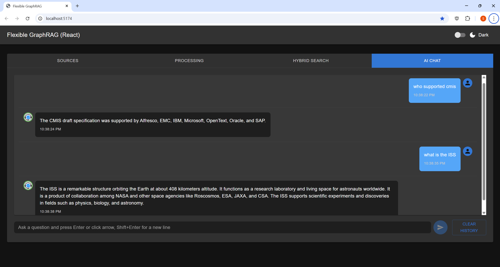

# Tab 4 — AI Chat

Conversational interface for iterative document Q&A.

- **Your questions** appear on the right; **AI answers** appear on the left
- Type your question and press **Enter** or click **Send**
- Full conversation history is preserved in the session
- Click **"CLEAR HISTORY"** to start a new conversation
- **Best for**: Follow-up questions, iterative exploration, multi-turn reasoning
