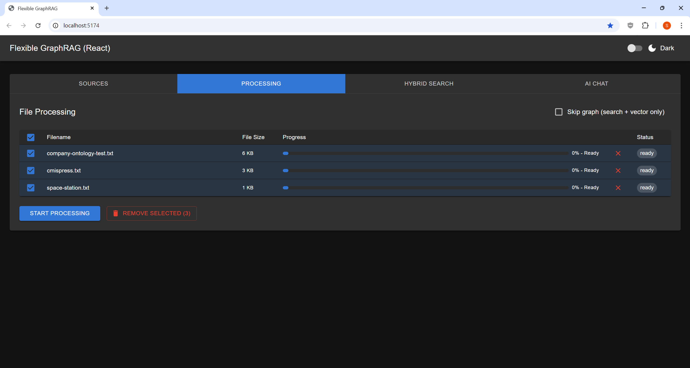
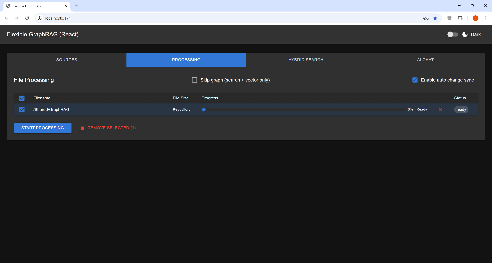

# Tab 2 — Processing

Process selected documents and monitor progress.

## Before Processing

Click **"START PROCESSING"** to begin. The button is visible once files or a data source are configured.



## Starting Processing

1. Select **"Enable auto change sync"** if you want automatic monitoring for file changes (supported sources only)
2. Click **"START PROCESSING"** to begin
3. Monitor real-time progress bars per file
4. The pipeline runs: document parsing → chunking → vector indexing → knowledge graph extraction → full-text indexing

## Processing Options

| Option | Description |
|---|---|
| **Document Parser** | Docling (local, free) or LlamaParse (cloud API) |
| **Skip Graph** | Skip knowledge graph extraction (vector + search only) |
| **Enable auto change sync** | Turn on incremental update tracking for this source |

## Processing Complete


## File Management

- Use checkboxes to select files, then click **"REMOVE SELECTED (N)"** to remove from the queue
- This removes from the processing queue — not from your source system

## Auto-Sync Processing

When **"Enable auto change sync"** is selected before clicking **"START PROCESSING"**, the system continues monitoring the source for changes after the initial ingest completes.



## Processing Pipeline

```
Document → Parser (Docling/LlamaParse)
         → Chunks (SentenceSplitter)
         → Embeddings → Vector DB (Qdrant, etc.)
         → KG Extraction (LLM) → Graph DB (Neo4j, etc.)
         → BM25 / Elasticsearch indexing
```
