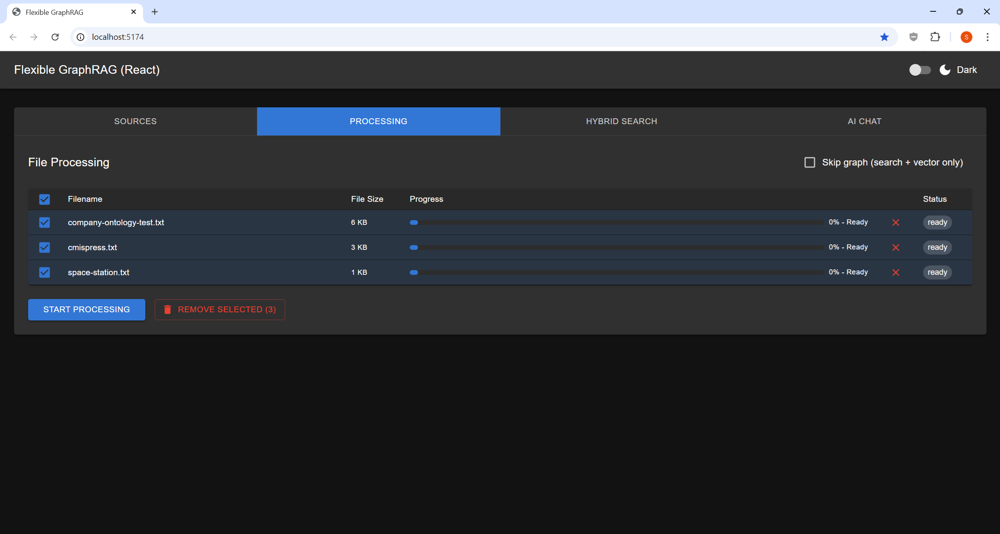
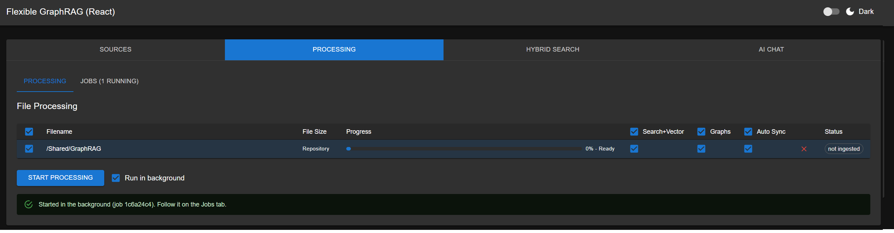
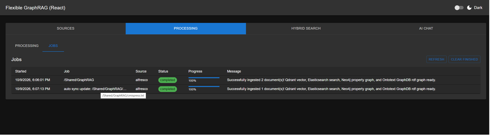
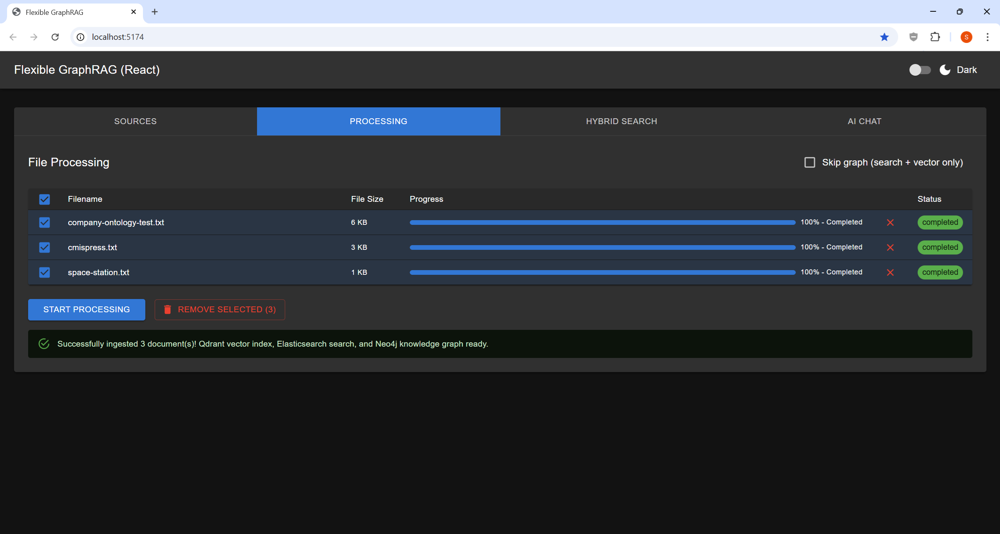
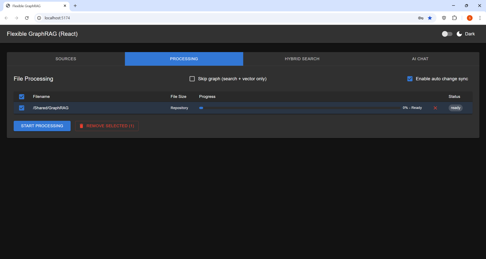

# Tab 2 — Processing

Process selected documents and monitor progress.

## Before Processing

Click **"START PROCESSING"** to begin. The button is visible once files or a data source are configured.



## Starting Processing

1. Select **"Enable auto change sync"** if you want automatic monitoring for file changes (supported sources only)
2. Click **"START PROCESSING"** to begin
3. Monitor real-time progress bars per file
4. The pipeline runs: document parsing → chunking → vector indexing → knowledge graph extraction → full-text indexing

## Processing Options

| Option | Description |
|---|---|
| **Document Parser** | Docling (local, free) or LlamaParse (cloud API) |
| **Skip Graph** | Skip knowledge graph extraction (vector + search only). Replaced by the per-row **Graphs** column when that is shown (below) |
| **Enable auto change sync** | Turn on incremental update tracking for this source. Replaced by the per-row **Auto Sync** column when that is shown (below) |
| **Run in background** | Start the job and keep the tab free to start another; follow it on the **Jobs** sub-tab |

## Search+Vector and Graphs per Row (Alfresco, Nuxeo, file uploads)

With the incremental system on (default or Langflow pipeline), the table gets two checkbox
columns that say what each row should end up in:

- **Search+Vector** — the vector and full-text search stores
- **Graphs** — the property graph and the RDF graph (needs Search+Vector)
- **Auto Sync** — kept up to date with repository changes (needs Search+Vector; Alfresco and
  Nuxeo only — uploaded files are not kept in sync, so they get the first two columns)

They start at what each row is in now (new rows: everything configured), and the **Status**
column shows that: *search+vector, graphs*, *search+vector*, *not ingested*, or *removed*, with
*(synced)* when an auto change sync holds it. A header checkbox sets a column for every row. A
column whose stores are set to `none` in `.env` is disabled.



Rows already in the stores start unchecked. Changing a row's Search+Vector or Graphs checks the
row; **START PROCESSING** then does, for each checked row:

| Search+Vector | Graphs | Row is in now | START PROCESSING |
|---|---|---|---|
| ☑ | ☑ | anything | ingest with graphs (a refresh if it is already there) |
| ☑ | ☐ | search+vector **and** graphs | remove the graphs only |
| ☑ | ☐ | search+vector only, or nothing | ingest without graphs (a refresh if already there) |
| ☐ | ☐ | anything | remove it from every store |

All of it runs as one job. Afterwards the rows' choices go back to their defaults, so pressing
START again does not repeat the run. Removing never touches the repository; ingest again to put
a row back.

**With auto change sync**, a removal sticks: a document whose graphs were removed keeps leaving
the graph out of its sync updates, and a document removed from every store stays out of the
sync (its row shows *removed*) even when it changes in the repository — until you ingest it
again. Renames and moves are still recorded. **Skip graph** is also kept for the datasource: once
none of its documents has a graph left, it is marked skip-graph, and an ingest with the graph
clears that.

### Auto Sync per Row

The **Auto Sync** column starts checked for rows an auto change sync follows. For each checked
row, START PROCESSING applies a change in it along with any store change:

- **Unchecked**: the sync stops for the row's documents — they stay in the stores as they are,
  and later repository changes leave them alone. If the row is one of the datasource's own roots
  (a node selected when the sync was set up, or its path), it also comes off the datasource's
  root list, so new files there are no longer picked up. Once a datasource has no roots left it
  stops syncing: it becomes an ingest-only record while some of its documents are still in a
  store (they can still be refreshed or removed here), and it is deleted once none is. So to
  remove an auto sync completely, uncheck Search+Vector (removes from every store) and Auto Sync
  on its rows.
- **Checked** on a row whose sync was stopped: it resumes (a root goes back on the list), and
  the row is ingested again, so edits made while its sync was off reach the stores right away. On a
  row no sync covers (say, two new documents, one checked): the run's datasource becomes an auto
  sync watching the checked rows, and the other rows ingested with them are recorded in it with
  their auto sync off — check them later to resume. It is all one job.

## Jobs Sub-tab

The Processing tab has two sub-tabs, **Processing** and **Jobs** (*Jobs (N running)* while some
run). Jobs lists the processing jobs — ones started here and auto sync runs — oldest first, with
start time, what was selected, source, status, progress and the full message (which names the
stores, e.g. *Removed 5 document(s) from Neo4j property graph and Ontotext GraphDB rdf graph.*).
Running ingest jobs can be cancelled; **Clear finished** removes finished ones from the list. The
backend keeps the list in memory until it restarts.



With **Run in background**, START returns at once and the Processing sub-tab is free; when the
job finishes, its per-file result and message are shown there like a foreground run. In KG
Spaces, leaving the page for elsewhere in ACA and coming back keeps the selection, the run and
its progress.

## Processing Complete



## File Management

- Click a row's **✕** to take it off the list — not from your source system, and not from the stores (see **Remove** above)

## Auto-Sync Processing

When **"Enable auto change sync"** is selected before clicking **"START PROCESSING"**, the system continues monitoring the source for changes after the initial ingest completes.



## Processing Pipeline

```
Document → Parser (Docling/LlamaParse)
         → Chunks (SentenceSplitter)
         → Embeddings → Vector DB (Qdrant, etc.)
         → KG Extraction (LLM) → Graph DB (Neo4j, etc.)
         → BM25 / Elasticsearch indexing
```
