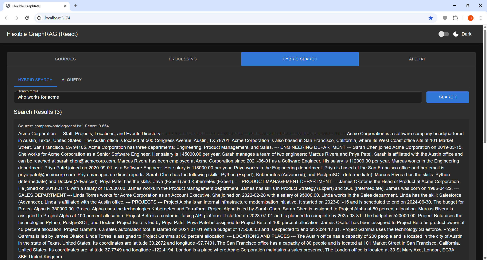
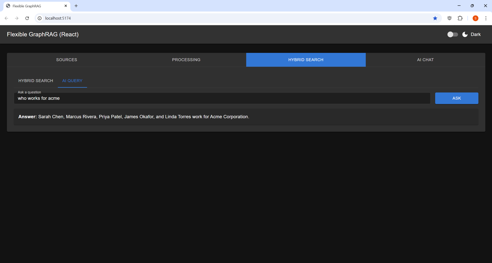

# Tab 3 — Hybrid Search

Two search modes available.

## Hybrid Search

Finds and ranks the most relevant document excerpts.

- **Input**: Search terms or phrases (e.g., `"machine learning algorithms"`)
- **Click**: SEARCH
- **Output**: Ranked list of excerpts with relevance scores and source filenames
- **Best for**: Research, fact-checking, finding specific passages

The search fuses **vector similarity** + **BM25 full-text** + **graph traversal** results.

## AI Query

AI-generated answers to natural language questions.

- **Input**: Natural language question (e.g., `"What are the main findings?"`)
- **Click**: ASK
- **Output**: AI-generated narrative answer synthesized from your documents
- **Best for**: Summarization, analysis, overviews

