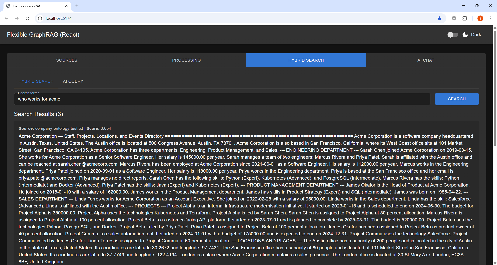
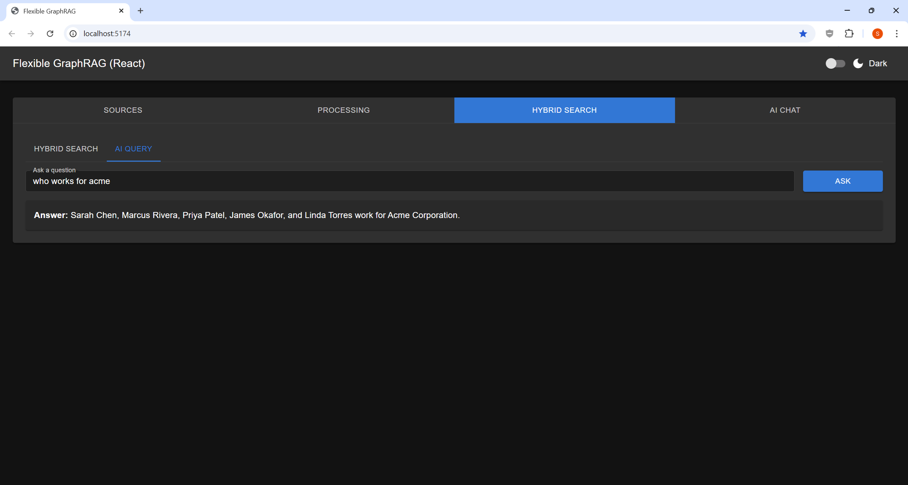

# Tab 3 — Hybrid Search

Two search modes available.

## Hybrid Search

Finds and ranks the most relevant document excerpts.

- **Input**: Search terms or phrases (e.g., `"machine learning algorithms"`)
- **Click**: SEARCH
- **Output**: Ranked list of excerpts with relevance scores and source filenames
- **Best for**: Research, fact-checking, finding specific passages

The search fuses **vector similarity** + **BM25 full-text** + **graph traversal** results.



## Source Labels in Results

Every search result shows which database it came from. The label appears after the filename:

```
cmispress.txt | Neo4j property graph
cmispress.txt | Elasticsearch search
company-ontology.txt | Qdrant vector
company-ontology.txt | Ontotext GraphDB rdf graph
```

Graph and RDF results name the document their facts came from too; a result built from several
documents lists up to two names, then *(+N more)*.

The document name is a link when the document can be opened, in a new browser tab: Alfresco
documents open in the Alfresco Content App's viewer (ACA at `ALFRESCO_ACA_URL` in the backend
`.env`, default `ALFRESCO_URL` + `/content-app`), or in Alfresco Share with `ALFRESCO_VIEWER=share`, or
any page via `ALFRESCO_OPEN_URL` (with `{node_id}` in it). Nuxeo documents open in the Nuxeo Web
UI; web pages and Wikipedia articles open at their URL, and a YouTube transcript segment opens the
video at that segment's start. In KG Spaces, Alfresco documents open in ACA's viewer in the same tab, and closing the viewer
(✕) brings you back to KG Spaces with your results and conversation.

When multiple databases return the same passage, duplicate filtering keeps only the highest-scoring copy — so not all configured databases will always appear in the results. This is expected behavior.

> **Note:** The screenshot above predates the source label feature. Current builds show the `filename | database` label on every result card.

---

## AI Query

AI-generated answers to natural language questions.

- **Input**: Natural language question (e.g., `"What are the main findings?"`)
- **Click**: ASK
- **Output**: AI-generated narrative answer synthesized from your documents, followed by
  **Sources:** — the documents the answer came from, best first, as links where they can be
  opened (see above)
- **Best for**: Summarization, analysis, overviews


