# Tab 1 — Sources

Configure your data source and select files for processing.

## File Upload

Auto sync is not supported for the file upload UI.

1. Select **"File Upload"** from the data source dropdown
2. Drag & drop files onto the upload area, or click to open a file picker (multi-select supported)
3. Supported formats: PDF, DOCX, XLSX, PPTX, TXT, MD, HTML, CSV, PNG, JPG, and more
4. Click **"CONFIGURE PROCESSING"** to proceed

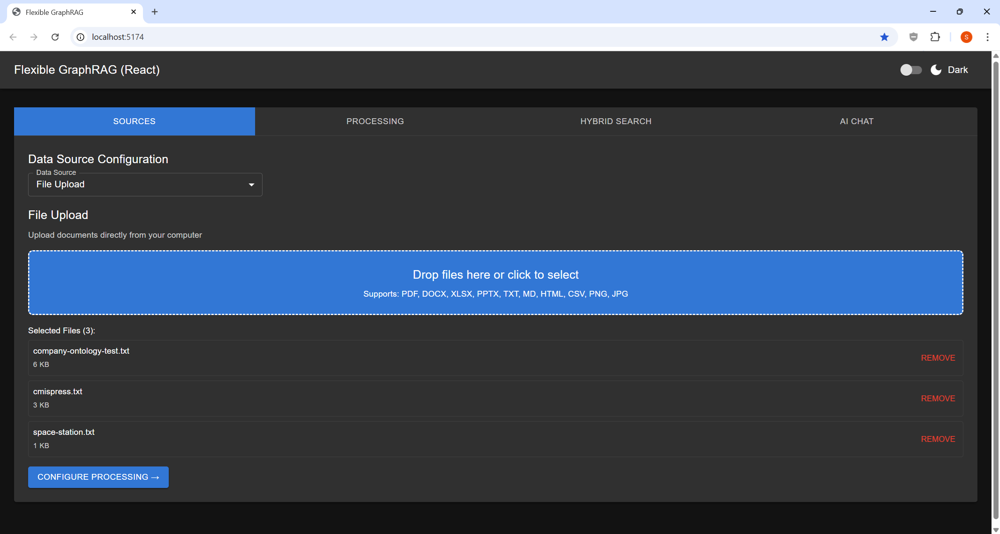

!!! note
    If you drag & drop new files after selecting via dialog, only the dragged files will be used.

!!! note "Local filesystem access"
    The UI uploads files to the backend server. To index files already on the server's local filesystem — with auto sync support — use the **MCP server** (`ingest_documents` with `filesystem` source) or the **REST API**.

## Alfresco Repository

Supports auto sync — select **"Enable auto change sync"** on the Processing tab before clicking **"START PROCESSING"**.

- **Alfresco Base URL** — e.g. `http://localhost:8080/alfresco`
- **Username / Password**
- **Path** — e.g. `/Sites/example/documentLibrary`

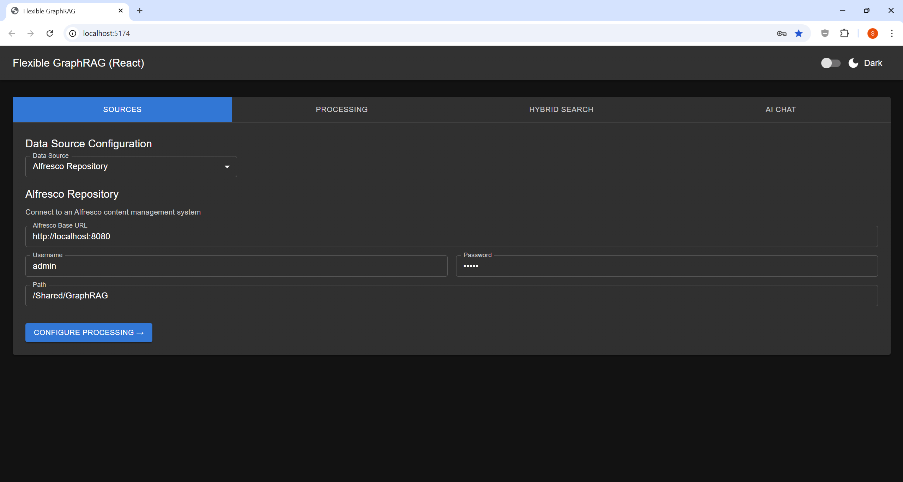

## CMIS Repository

Auto sync is not supported for this source.

- **CMIS Repository URL** — e.g. `http://localhost:8080/alfresco/api/-default-/public/cmis/versions/1.1/atom`
- **Username / Password**
- **Folder path** — e.g. `/Sites/example/documentLibrary`

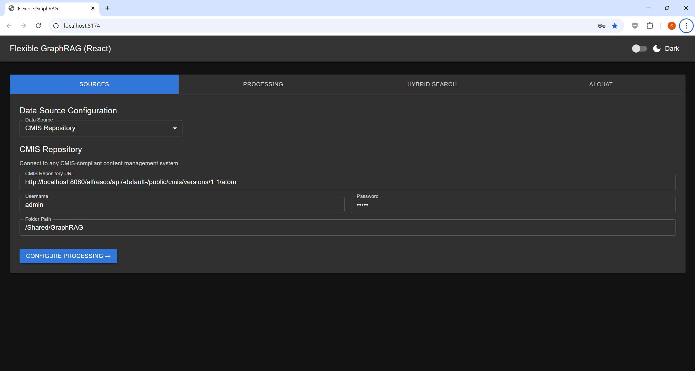

## Web Pages

Auto sync is not supported for this source.

- **URLs** — list of web page URLs to fetch and index

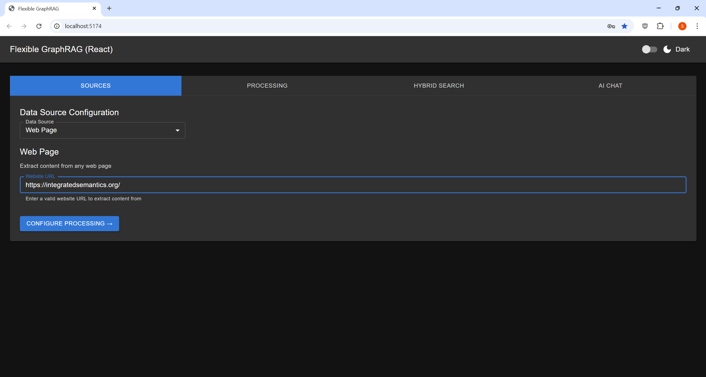

## Wikipedia

Auto sync is not supported for this source.

- **Titles** — list of Wikipedia article titles

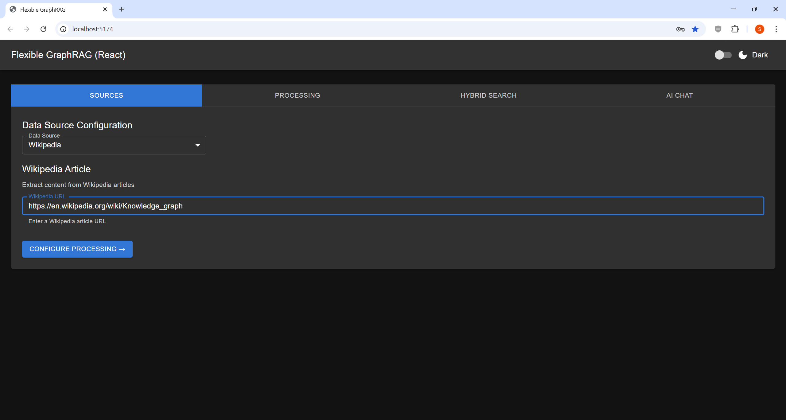

## YouTube

Auto sync is not supported for this source.

- **URLs** — list of YouTube video URLs (transcripts are indexed)

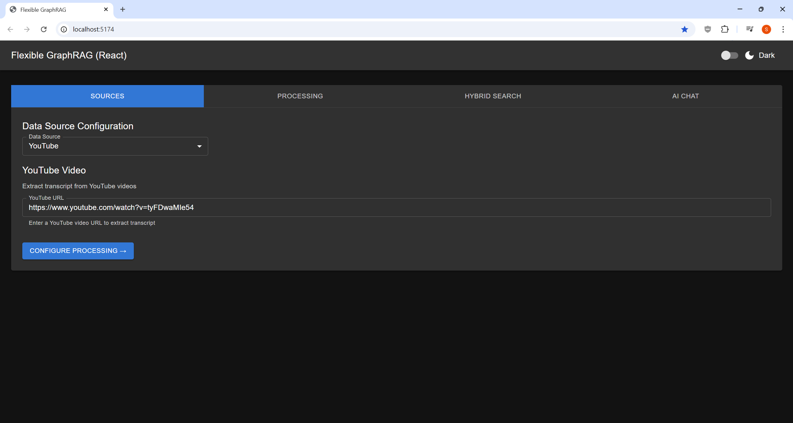

## Google Drive

Supports auto sync — select **"Enable auto change sync"** on the Processing tab before clicking **"START PROCESSING"**.

- **Credentials Path** — path to your service account JSON file
- **Folder ID** — Google Drive folder ID to index

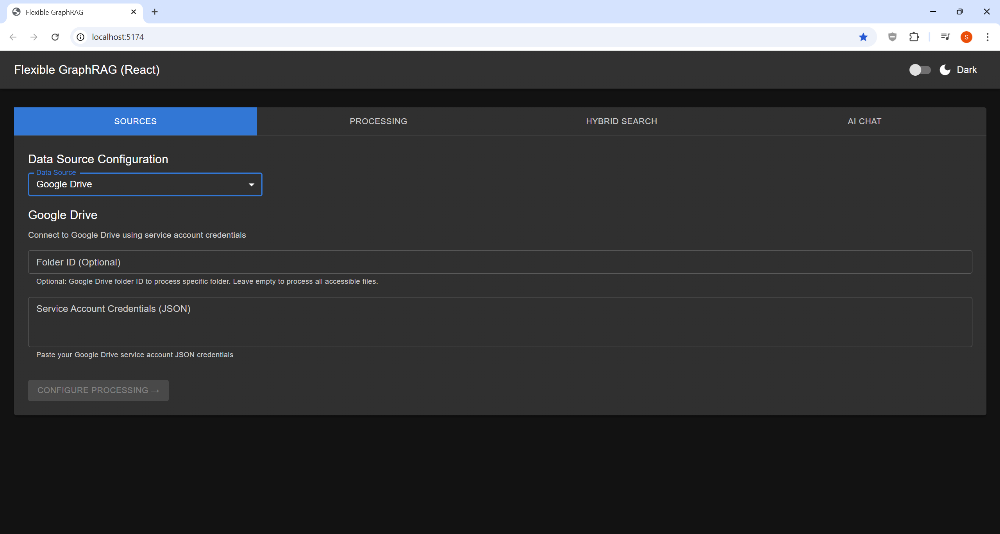

## Microsoft OneDrive

Supports auto sync — select **"Enable auto change sync"** on the Processing tab before clicking **"START PROCESSING"**.

- **Client ID / Client Secret / Tenant ID**

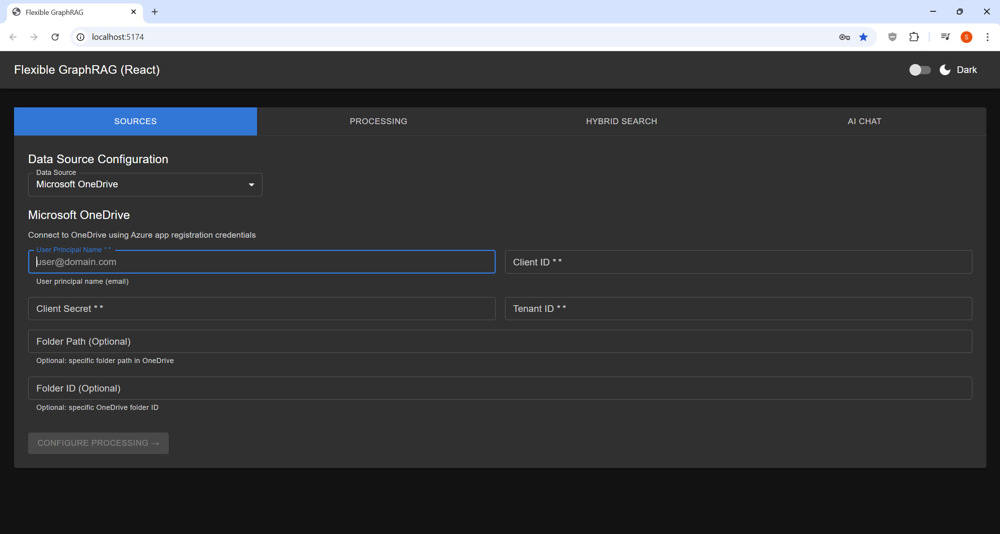

## Amazon S3

Supports auto sync — select **"Enable auto change sync"** on the Processing tab before clicking **"START PROCESSING"**. Also provide the **SQS Queue URL** in the source form.

- **Bucket** — S3 bucket name
- **AWS Access Key ID / Secret Access Key / Region**

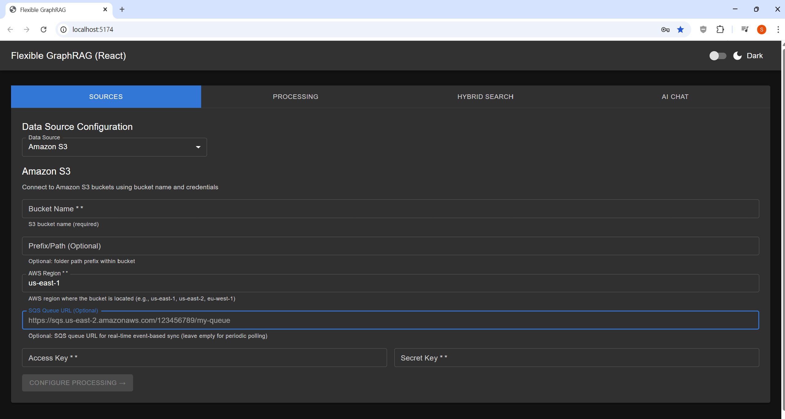

## Azure Blob Storage

Supports auto sync — select **"Enable auto change sync"** on the Processing tab before clicking **"START PROCESSING"**.

- **Connection String**
- **Container Name**

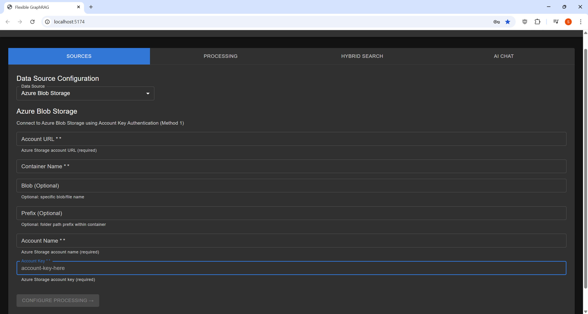

## Google Cloud Storage

Supports auto sync — select **"Enable auto change sync"** on the Processing tab before clicking **"START PROCESSING"**. Also provide the **Pub/Sub Subscription Name** in the source form.

- **Bucket Name**
- **Credentials Path** — path to your service account JSON file

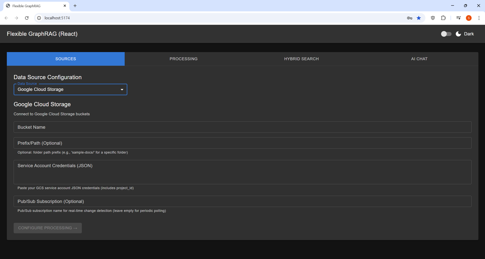

## Box

Supports auto sync — select **"Enable auto change sync"** on the Processing tab before clicking **"START PROCESSING"**.

- **Client ID / Client Secret**
- **Folder ID**

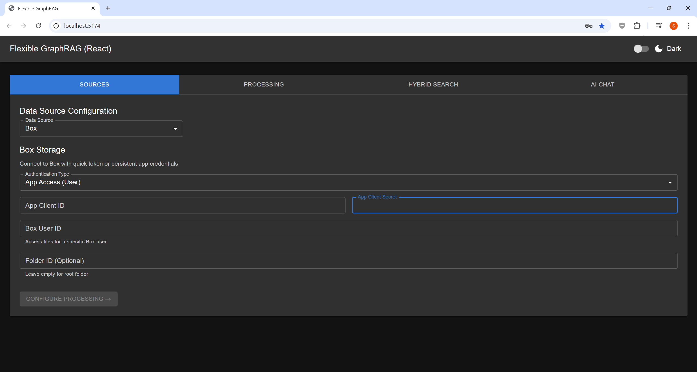

## SharePoint

Supports auto sync — select **"Enable auto change sync"** on the Processing tab before clicking **"START PROCESSING"**.

- **Client ID / Client Secret / Tenant ID**
- **Site URL**

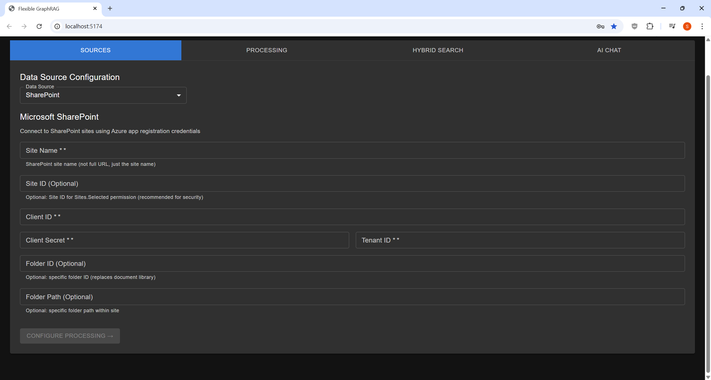

## All 13 Data Sources

| Category | Sources |
|---|---|
| File & Upload | File Upload |
| Cloud Storage | Amazon S3, Google Cloud Storage, Azure Blob Storage, Google Drive, Microsoft OneDrive |
| Enterprise Repositories | Alfresco, Microsoft SharePoint, Box, CMIS |
| Web Sources | Web Pages, Wikipedia, YouTube |

See [Data Sources](../DATA-SOURCES/OVERVIEW.md) for full configuration details for each source.

## Auto-Sync (Incremental Updates)

Select **"Enable auto change sync"** on the Processing tab **before clicking "START PROCESSING"** to automatically keep your databases synchronized when files change.

- S3: also provide the **SQS Queue URL**
- GCS: also provide the **Pub/Sub Subscription Name**

See [Incremental Auto-Sync](../DATA-SOURCES/INCREMENTAL-UPDATE-AUTO-SYNC/README.md) for setup details.
